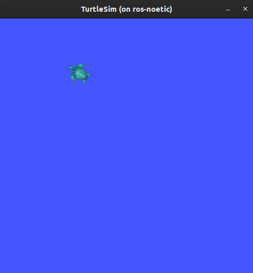
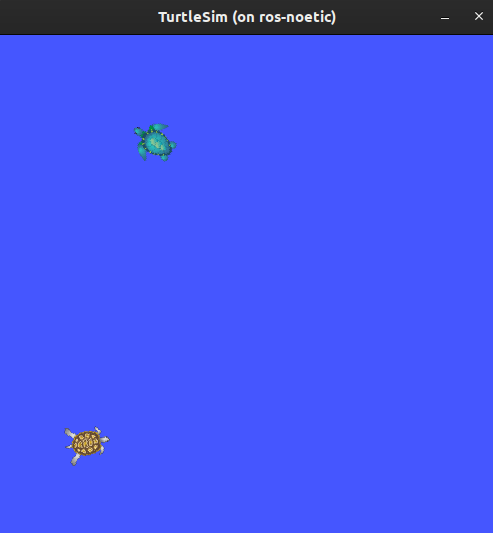

# Understanding ROS Services

**Goal**: Learn about services in ROS using command line tools.

## Background

Services are another method of communication for nodes in the ROS graph. Services are based on a call-and-response model, versus topics’ publisher-subscriber model. While topics allow nodes to subscribe to data streams and get continual updates, services only provide data when they are specifically called by a client.


## Prerequisites

As always, don’t forget to source ROS 2 in every new terminal you open.

Run `roscore` in a separate terminal.

## Tasks

### 1 Setup

Start up the two turtlesim nodes, `/turtlesim` and `/teleop_turtle`.

Open a new terminal and run:

```bash
rosrun turtlesim turtlesim_node
```

Open another terminal and run:

```bash
rosrun turtlesim turtle_teleop_key
```

### 2 rosservice list

Running the `rosservice list` command in a new terminal will return a list of all the services currently active in the system:

```bash
/clear
/kill
/reset
/rosout/get_loggers
/rosout/set_logger_level
/spawn
/teleop_turtle/get_loggers
/teleop_turtle/set_logger_level
/turtle1/set_pen
/turtle1/teleport_absolute
/turtle1/teleport_relative
/turtlesim/get_loggers
/turtlesim/set_logger_level
```

For now, let’s focus on the turtlesim-specific services, `/clear`, `/kill`, `/reset`, `/spawn`, `/turtle1/set_pen`, `/turtle1/teleport_absolute`, and `/turtle1/teleport_relative`. You may recall interacting with some of these services using rqt in the `[[“Introducing turtlesim and rqt”](introducing_turtlesim_and_rqt.html) tutorial.

### 3 rosservice type

Services have types that describe how the request and response data of a service is structured. Service types are defined similarly to topic types, except service types have two parts: one message for the request and another for the response.

To find out the type of a service, use the command:

```bash
rosservice type <service_name>
```

Let’s take a look at turtlesim’s `/clear` service. In a new terminal, enter the command:

```bash
rosservice type /clear
```

Which should return:

```bash
std_srvs/Empty
```

The `Empty` type means the service call sends no data when making a request and receives no data when receiving a response.

### 4 rosservice find

If you want to find all the services of a specific type, you can use the command:

```bash
rosservice find <type_name>
```

For example, you can find all the `Empty` typed services like this:

```bash
rosservice find std_srvs/Empty 
```

Which will return:

```bash
/clear
/reset
```

### 5 rossrv show

You can call services from the command line, but first you need to know the structure of the input arguments.

```bash
rossrv show <type_name>
```

To run this command on the `/clear` service’s type, `Empty`:

```bash
rossrv show std_srvs/Empty 
```

Which will return:

```bash
---
```

The `---` separates the request structure (above) from the response structure (below). But, as you learned earlier, the `Empty` type doesn’t send or receive any data. So, naturally, its structure is blank.

Let’s introspect a service with a type that sends and receives data, like `/spawn`. From the results of `rosservice list` and `rosservice type`, we know `/spawn`’s type is `turtlesim/Spawn`.

To see the arguments in a `/spawn` call-and-request, run the command:

```bash
rossrv show turtlesim/Spawn 
```

Which will return:

```bash
float32 x
float32 y
float32 theta
string name
---
string name
```

The information above the `---` line tells us the arguments needed to call `/spawn`. `x`, `y` and `theta` determine the location of the spawned turtle, and `name` is clearly optional.

The information below the line isn’t something you need to know in this case, but it can help you understand the data type of the response you get from the call.

### 6 rosservice call

Now that you know what a service type is, how to find a service’s type, and how to find the structure of that type’s arguments, you can call a service using:

```bash
rosservice call <service_name> <arguments>
```

The `<arguments>` part is optional. For example, you know that `Empty` typed services don’t have any arguments:

```bash
rosservice call /clear
```

This command will clear the turtlesim window of any lines your turtle has drawn.




Now let’s spawn a new turtle by calling `/spawn` and inputting arguments. Input `<arguments>` in a service call from the command-line need to be in YAML syntax.

Enter the command:

```bash
rosservice call /spawn "{x: 2, y: 2, theta: 0.2, name: ''}"
```

You will get this output on terminal:

```bash
name: "turtle2"
```

Your turtlesim window will update with the newly spawned turtle right away:



## Summary

Nodes can communicate using services in ROS. Unlike a topic - a one way communication pattern where a node publishes information that can be consumed by one or more subscribers - a service is a request/response pattern where a client makes a request to a node providing the service and the service processes the request and generates a reponse.

You generally don’t want to use a service for continuous calls; topics or even actions would be better suited.

In this tutorial you used command line tools to identify, elaborate on, and call services.

---