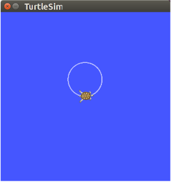
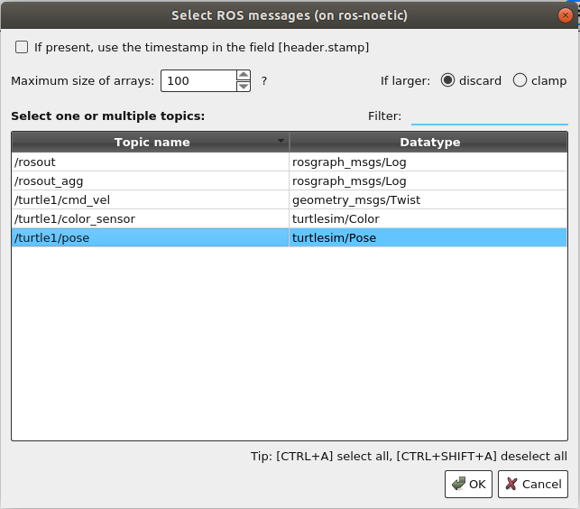
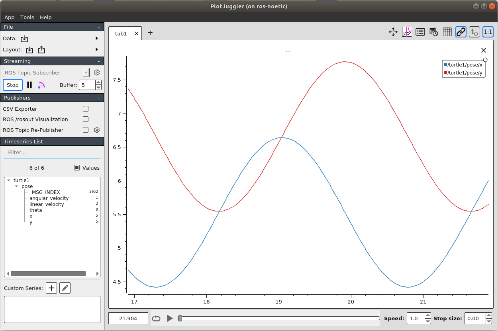

# Plot Juggler

  - PlotJuggler is an application to plot logged data, in particular timeseries.
  - It helps to visualize time series that is fast, powerful and intuitive.

## Installation
  **For ROS users, to install PlotJuggler just type:**
  ```bash
  sudo apt install ros-${ROS_DISTRO}-plotjuggler-ros
  ```
  which for ROS-noetic will be:
  ```bash
  sudo apt install ros-noetic-plotjuggler-ros
  ```
  To launch PlotJuggler on ROS, use the comand:
  ```bash
  rosrun plotjuggler plotjuggler
  ```

  or, if are using ROS2:
  ```bash
  ros2 run plotjuggler plotjuggler

  ```

  for more details vist [here](https://github.com/facontidavide/PlotJuggler/blob/main/README.md)

## Visualizing Streamed Data

  PlotJuggler is most commonly used to visualize data that is stored in a log file, for instance a [CSV](https://en.wikipedia.org/wiki/Comma-separated_values) or a [rosbag](http://wiki.ros.org/rosbag). This kind of data is usually loaded using plugins named "DataLoader".

  Additionally, it is possible to visualize data that is being streamed. The user can easily start and stope streaming and decide the size of the buffer (in seconds).

  Note that some functionalities such as zoom, pan and the time tracker are disabled when streaming is ON.
  
  Lets try it on the turtlesim tutorial.

  Open the terminal and run roscore.

  ```bash
  roscore
  ```

  in second terminal run:

  ```bash
  rosrun turtlesim turtlesim_node
  ```

  This window will open:
  

  In third terminal run command:

  ```bash
  rostopic pub -r 1 /turtle1/cmd_vel geometry_msgs/Twist -- '[2.0, 0.0, 0.0]' '[0.0, 0.0, 1.8]'
  ```

  this will make the turtle move in a circle.
  

  In the fourth terminal run PlotJuggler.

  ```bash
  rosrun plotjuggler plotjuggler
  ```
  This window will open:
  

  Under the Streaming tab select ROS Topic Subscriber
  and then click on start.

  A new window will open.
  

  Select the Ros topic u want for now select /turtle1/pose.

  Now turtle1 ros topic will be available inthe timeseries. U can drag and drop individual data or messages that u want to plot.

  Select turtle1/pose/x and turtle1/pose/y.

  The selected Data will be plotted.
  

### Reference
  - [PlotJuggler](https://facontidavide.github.io/PlotJuggler/data_sources/index.html)