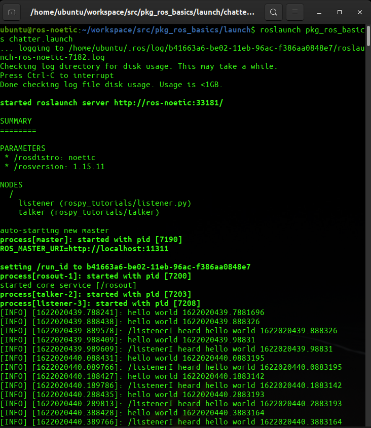

# Example #1: Launch two ROS Nodes

## Aim

- To launch `talker` and `listener` node present in `rospy_tutorials` package.
- For this create a `chatter.launch` file and save it in the `launch` folder inside `pkg_ros_basics` package.

> **NOTE**: To install `rospy_tutorials` package in your system you can run `sudo apt-get install ros-noetic-ros-tutorials` this command.

Once installed, you can use `listener` python script and talker executable written in C++ present in `rospy_tutorials` package.

## Code

`chatter.launch`
```xml
<launch>
  <node name="talker" pkg="rospy_tutorials" type="talker" output="screen"/>
  <node name="listener" pkg="rospy_tutorials" type="listener.py" output="screen"/>
</launch>
```

<center><a href="chatter.launch" download><button>Download</button></a></center>

- Here first `talker.cpp` file (for cpp file we dont need to add .cpp extension) has been included with the node name as talker and also set output as screen so you can see the output from talker node.
- Next we have added `listener.py` which has node name as listener and here also we have set output as screen.

## Run Command

Now run these command to run the launch file,
```bash
roslaunch pkg_ros_basics chatter.launch
```

## Output



---