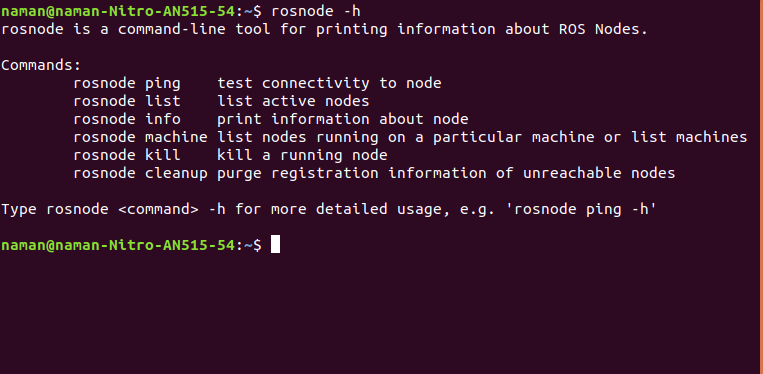
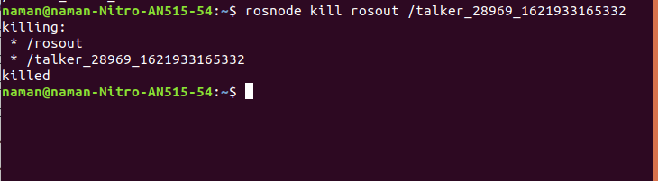

# Command: rosnode
`rosnode` contains the rosnode command-line tool for displaying debug information about [ROS Nodes](http://wiki.ros.org/Nodes).

<blockquote>
<p> Note: For quick information about any command, be that outside of ROS, simply type the command along with suffix `--h` or `-help`. This is a widely used concept among other Linux commands for quick references. Here's an example for `rosnode --h` command
</p>
</blockquote>



## list

`rosnode list` displays a list of all current nodes.

Let's figure out what argument the `list` sub-command needs. In a new terminal run start the rosmaster:

```bash
roscore
```

And in another terminal, run:

```bash
rosrun rospy_tutorials talker
```

And in another terminal, run:

```bash
rosnode list
```

Now the node named `talker`(node with word talker in it) will be printed on the terminal.


## info

`rosnode info /node_name` displays information about a node, including publications and subscriptions.

Let's figure out what argument the `info` sub-command needs. In a new terminal run start the rosmaster:

```bash
roscore
```

And in another terminal, run:

```bash
rosrun rospy_tutorials talker
```

And in another terminal, run:

```bash
rosnode info <talker_node>
```

This should give details related to the particular node as shown below:


## kill

IMPORTANT: rosnode kill is not guaranteed to succeed. Let's figure out what argument the `kill` sub-command needs. In a new terminal run start the rosmaster:

```bash
roscore
```
And in another terminal, run:

```bash
rosrun rospy_tutorials talker
```

And in another terminal, run:

```bash
rosnode kill rosout <talker_node>

```


Interactive mode. This enables you to select which node to kill from a numbered list, which is useful for killing anonymous nodes.

```bash
rosnode kill
1. /rosout

Please enter the number of the node you wish to kill.
```
<hr>