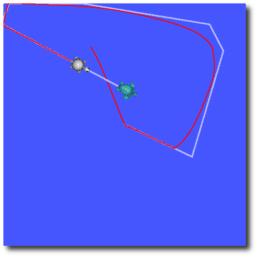

# ROS tf using turtlesim:
  This tutorial will give you a good idea of what tf can do for you. It shows off some of the tf power in a multi-robot example using [turtlesim](http://wiki.ros.org/turtlesim). This also introduces using [tf_echo](http://wiki.ros.org/tf#tf_echo), [view_frames](http://wiki.ros.org/tf#view_frames), [rqt_tf_tree](http://wiki.ros.org/rqt_tf_tree), and [rviz](http://wiki.ros.org/rviz).

## 1. Set Up the Demo
  The nodes for this tutorial are released for Ubuntu, so go ahead and install them: 
  ```bash
  $ sudo apt-get install ros-noetic-ros-tutorials ros-noetic-geometry-tutorials ros-noetic-rviz ros-noetic-rosbash ros-noetic-rqt-tf-tree
  
  ```

## 2. Running the Demo
  Now that we're done getting the turtle_tf tutorial package, let's run the demo. 
  ```bash
  $ roslaunch turtle_tf turtle_tf_demo.launch
  ```
  You will see the turtlesim start with two turtles. 

  

  Once the turtlesim is started you can drive the center turtle around in the turtlesim using the keyboard arrow keys, select the **roslaunch terminal window** so that your keystrokes will be captured to drive the turtle.

  

  As you can see that one turtle will continuously move to follow the turtle you are driving around. 

## 3. What is Happening

  This demo is using the tf library to create three coordinate frames: a world frame, a turtle1 frame, and a turtle2 frame. This tutorial uses a **tf broadcaster** to publish the turtle coordinate frames and a **tf listener** to compute the difference in the turtle frames and move one turtle to follow the other. 

### Reference
  - [ros_tf_tutorial](http://wiki.ros.org/tf/Tutorials/Introduction%20to%20tf)