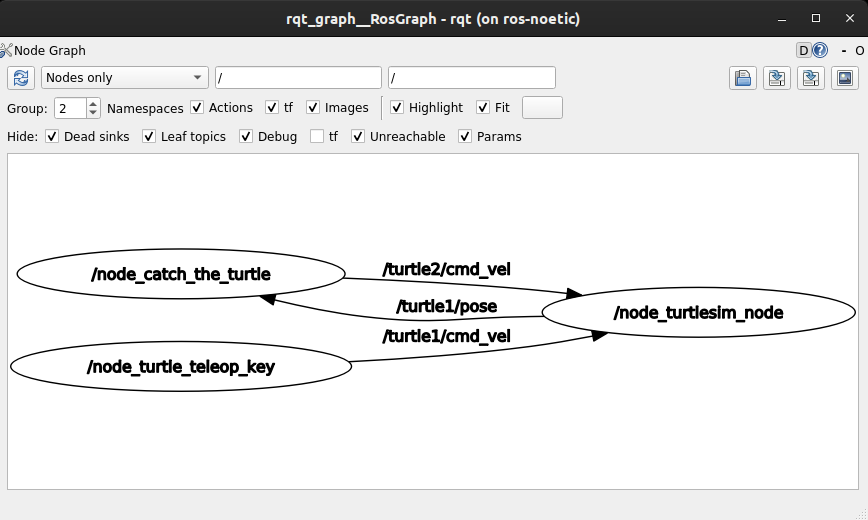

# Expected Output

- The following videos can be considered as a valid output.


> **Note**: First, let `turtle2` reach `turtle1` then only move `turtle1`.

- To know whether the nodes are talking to each other as expected one can use the command `rqt_graph`. Below, you can find an expected graph for this task.



- Your terminal should look like this at the startup of roslaunch server.

```bash
ubuntu@ros-noetic:~$ roslaunch pkg_task0 turtle-task.launch 
... logging to /home/ubuntu/.ros/log/6f7d513a-c084-11eb-9883-a5ac155eafae/roslaunch-ros-noetic-10780.log
Checking log directory for disk usage. This may take a while.
Press Ctrl-C to interrupt
Done checking log file disk usage. Usage is <1GB.

started roslaunch server http://ros-noetic:34763/

SUMMARY
========

PARAMETERS
 * /node_turtlesim_node/background_b: 34
 * /node_turtlesim_node/background_g: 139
 * /node_turtlesim_node/background_r: 34
 * /rosdistro: noetic
 * /rosversion: 1.15.11

NODES
  /
    node_catch_the_turtle (pkg_task0/node_catch_the_turtle.py)
    node_turtle_teleop_key (turtlesim/turtle_teleop_key)
    node_turtlesim_node (turtlesim/turtlesim_node)

auto-starting new master
process[master]: started with pid [10788]
ROS_MASTER_URI=http://localhost:11311

setting /run_id to 6f7d513a-c084-11eb-9883-a5ac155eafae
process[rosout-1]: started with pid [10798]
started core service [/rosout]
process[node_turtlesim_node-2]: started with pid [10801]
process[node_turtle_teleop_key-3]: started with pid [10805]
process[node_catch_the_turtle-4]: started with pid [10807]
Reading from keyboard
---------------------------
Use arrow keys to move the turtle. 'q' to quit.
[ INFO] [1622296061.324015602]: Starting turtlesim with node name /node_turtlesim_node
[ INFO] [1622296061.328553969]: Spawning turtle [turtle1] at x=[5.544445], y=[5.544445], theta=[0.000000]
[ INFO] [1622296061.657708547]: Spawning turtle [turtle2] at x=[1.000000], y=[1.000000], theta=[0.000000]
```

---