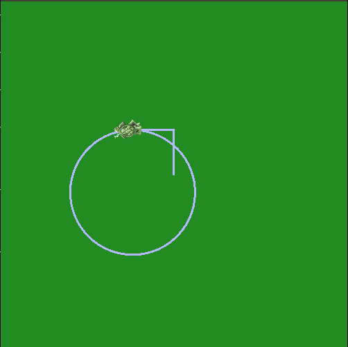

# Expected Output

  - If you draw a square it should look something like this.
    

  - This can be considered as a valid output or end result.
    

  - To know whether the nodes are talking to each other as expected one can use the command `rqt_graph`. Below, you can find an expected graph for this task.
  	